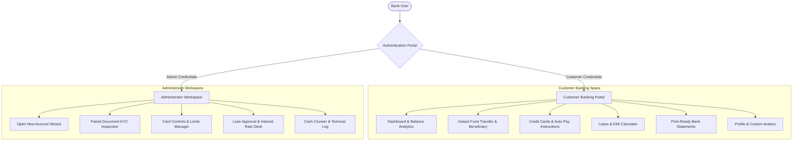

# 🏦 Vertex Galaxy Bank (VGB) - Enterprise Digital Banking System
## 🚀 Project Showcase & Technical Presentation

> **A secure, modern, enterprise-grade digital banking platform built with Java 17, Jakarta Servlets 6.1, JSP 3.0, Apache Tomcat 10.1, MySQL 8.0, Docker, and Maven.**

---

## 🌟 Executive Summary

**Vertex Galaxy Bank (VGB)** is a full-stack, cloud-ready core banking application designed to handle end-to-end digital financial operations. Built following a strict **3-Tier Layered Architecture**, VGB balances robust backend transactional integrity with a responsive, modern UI featuring **Instant Dark/Light Mode Theme Switching**, **Multi-page Printable Bank Statements**, **Paired Document KYC Verification**, and **Comprehensive Card Limits & Controls**.

---

## 🎯 Feature Highlights & Core Capabilities



---

### 1. 👤 Customer Banking Space

- 📊 **Interactive Dashboard**: Real-time account balances, total deposits, total withdrawals, available liquidity, and live transaction activity feed.
- 💸 **Instant Fund Transfers**:
  - Internal transfer between customer accounts.
  - External interbank wire transfer.
  - Beneficiary management (add, search, delete saved payees).
  - Instant transaction receipt rendering.
- 📄 **Multi-Page Printable Bank Statements**:
  - Print-optimized CSS (`@media print`) isolating official banking statement letterheads.
  - Automatic header repetition across PDF page breaks.
  - Detailed debit/credit transaction breakdown with timestamped audit logs.
- 💳 **Credit Card & Auto-Pay Operations**:
  - Support for Classic, Gold, Platinum, and Royale Metallic cards.
  - Full, minimum, or custom card bill repayments.
  - Automated recurring Auto-Pay instruction management.
- 💰 **Loan Center**:
  - Loan categories: Home, Personal, Car, and Education loans.
  - Built-in EMI Calculator & Interest Schedule visualizer.
  - Direct application submission, balance tracking, and repayment log.
- 🖼️ **Profile & Avatar System**:
  - Custom profile avatar file uploads saved into workspace source directories.
  - Automatic avatar sanitization and fallback handling (`onerror`).
  - Security PIN & BCrypt password management.

---

### 2. 👑 Enterprise Admin Workspace

- 🧙‍♂️ **Account Creation Wizard**: 5-step interactive workflow for creating Individual, Joint, Savings, Current, Salary, Student, and Fixed Deposit accounts.
- 📄 **Paired Document KYC Verification**:
  - File inputs paired directly with document ID numbers for **Aadhaar Card**, **PAN Card**, **Passport**, **Driving License**, and **Voter ID**.
  - Real-time client-side JS regex validation (Aadhaar 12-digit format, PAN 10-character alphanumeric format).
  - Single-click approval/rejection with relationship manager assignment.
- 🎛️ **Card Controls & Limits Modal**:
  - Responsive modal layout (`max-height: 85vh`) with pinned headers/footers and smooth scrollable middle body.
  - Custom sliders for adjusting Daily ATM Limits, POS Purchasing Limits, International Online Usage, and Freeze/Unfreeze toggles.
- 🏦 **Cash Counter Terminal**:
  - Teller desk interface for handling over-the-counter cash deposits and cash withdrawals.
  - Real-time balance updates and transaction logging.

---

### 3. 🐳 Cloud-Ready Docker Architecture

- **Multi-Stage Dockerfile**:
  - **Stage 1 (Build)**: `maven:3.9-eclipse-temurin-17` packages `VGB-Banking-System-1.0.war`.
  - **Stage 2 (Runtime)**: `tomcat:10.1-jdk17-temurin` deploys the WAR as `ROOT.war` and starts Tomcat automatically via `CMD ["catalina.sh", "run"]`.
- **Docker Compose Orchestration**:
  - **`vgb-mysql-db`**: MySQL 8.0 container initialized automatically with database schema and seed data (`vgb_database.sql`).
  - **`vgb-banking-app`**: Tomcat 10.1 container with health check dependencies ensuring MySQL is ready before starting Tomcat.

---

### 4. 🌓 Instant Manual Dark / Light Mode Theme System

- **Zero Delay Toggle**: Instant 0ms DOM switching between Light and Dark themes.
- **Persistent Preferences**: Saves user selection in `localStorage` (`vgb_theme`) across browser sessions.
- **Anti-Flicker Script**: Inline `<head>` script prevents white screen flashes during navigation.
- **High Specificity CSS**: Applies deep slate backgrounds (`#0f172a` / `#1e293b`) and high-contrast text (`#f8fafc`) across all 26 JSP pages.

---

## 📸 Interface Screenshots & Visual Component Showcase

### 1. Card Controls & Limits Modal (Customer & Admin Sides)
> Pinned header/footer layout with scrollable body (`max-height: 85vh; margin: auto;`), ensuring daily limits, ATM settings, and save buttons remain completely visible.


---

### 2. Customer Profile Avatar Header & Fallback
> Header navigation rendering custom avatar images with automated fallback handlers (`onerror`) preventing broken image icons.


---

### 3. Admin Account Creation - Paired KYC Document Upload
> Section E2 of the Open Account registration form pairing each document copy file input with its corresponding ID number field.


---

### 4. Admin Card Controls & Auto-Pay Management Modal
> Admin management modal overlay holding card parameters, security switches, daily limits, and auto-pay preferences.


---

## 🏛️ System Architecture & 3-Tier Layering

```
                     +---------------------------------------+
                     |         Presentation Layer            |
                     |  - JSP Views (Customer & Admin)       |
                     |  - Vanilla CSS3 (Dark/Light Modes)    |
                     |  - Modern JavaScript (script.js)      |
                     +-------------------+-------------------+
                                         |
                                         v HTTP / JSON
                     +---------------------------------------+
                     |           Controller Layer            |
                     |  - Jakarta Servlets 6.1 (17 Servlets) |
                     |  - Security & Authentication Filters  |
                     +-------------------+-------------------+
                                         |
                                         v Java Method Calls
                     +---------------------------------------+
                     |         Business Service Layer        |
                     |  - AccountService, CustomerService    |
                     |  - CardService, LoanService           |
                     |  - AutoPayService, AuthService        |
                     +-------------------+-------------------+
                                         |
                                         v SQL Queries
                     +---------------------------------------+
                     |        Data Access Layer (DAO)        |
                     |  - CustomerDAOImpl, AccountDAOImpl    |
                     |  - CardDAOImpl, LoanDAOImpl           |
                     +-------------------+-------------------+
                                         |
                                         v JDBC Connection Pool
                     +---------------------------------------+
                     |           Database Layer              |
                     |  - MySQL 8.0 Server (vgb_database)   |
                     +---------------------------------------+
```

---

## 🛠️ Technology Stack Breakdown

| Technology Layer | Tool / Specification | Version | Purpose |
| :--- | :--- | :--- | :--- |
| **Language** | Java SE | 17 | Core backend runtime |
| **Web Container** | Apache Tomcat | 10.1.x | Jakarta EE 10 web container |
| **Servlet Standard** | Jakarta Servlet API | 6.1.0 | HTTP Request/Response Controllers |
| **View Template** | JSP & Jakarta JSTL | 3.0.x | Server-rendered UI views |
| **Database** | MySQL Server | 8.0 / 9.0 | Relational database storage |
| **Containerization** | Docker & Docker Compose | Latest | Automated container environment |
| **Build System** | Apache Maven | 3.9+ | Dependency management & packaging |
| **Security** | jBCrypt | 0.4 | Password hashing & encryption |
| **JSON Library** | Google Gson | 2.11.0 | Data serialization |
| **Logging** | SLF4J + SimpleLogger | 2.0.13 | Transaction & system auditing |

---

## 🗺️ Servlets & Controller Mapping

| Servlet Class | URL Pattern | Responsibility |
| :--- | :--- | :--- |
| `LoginServlet` | `/login` | User authentication & session initialization |
| `LogoutServlet` | `/logout` | Session invalidation & security cleanup |
| `CustomerDashboardServlet` | `/customer-dashboard` | Customer dashboard metrics & recent transactions |
| `AdminDashboardServlet` | `/admin-dashboard` | Admin system overview & analytics |
| `AccountServlet` | `/account` | Account creation, listing, edit, and status management |
| `CardServlet` | `/card` | Credit & Debit card applications, limits, and controls |
| `CreditCardRepaymentServlet` | `/card-repayment` | Card bill repayments & receipt generation |
| `LoanServlet` | `/loan` | Loan applications, EMI calculations, and approvals |
| `AutoPayServlet` | `/auto-pay` | Recurring auto-pay instruction setup & processing |
| `CashCounterServlet` | `/cash-counter` | Teller desk cash deposits & withdrawals |
| `ChequeBookServlet` | `/chequebook` | Cheque book requests & issue management |
| `PassbookServlet` | `/passbook` | Passbook print request handling |
| `UploadProfileServlet` | `/upload-profile` | Profile avatar image upload & file sync |
| `UpdateProfileServlet` | `/update-profile` | Customer profile information update |
| `ForgotPasswordServlet` | `/forgot-password` | Password recovery using identity verification |

---

## 🚀 Quick Launch Guide (Docker)

```bash
# 1. Clone or navigate to the project root directory
cd "d:\InternShip Project\VGB-Banking-System-Java"

# 2. Build and launch MySQL & Tomcat containers
docker compose up --build -d

# 3. Access in Web Browser
# Open: http://localhost:8080
```

---

## 🔐 Default Administrator Login

| Credential Field | Default Value |
| :--- | :--- |
| **Admin Username** | `vgb@admin$17193` |
| **Admin Password** | `admin@17193$` |
| **Security PIN** | `1234` |

---

<div align="center">

**Vertex Galaxy Bank (VGB)** • Enterprise Digital Banking Architecture

</div>
